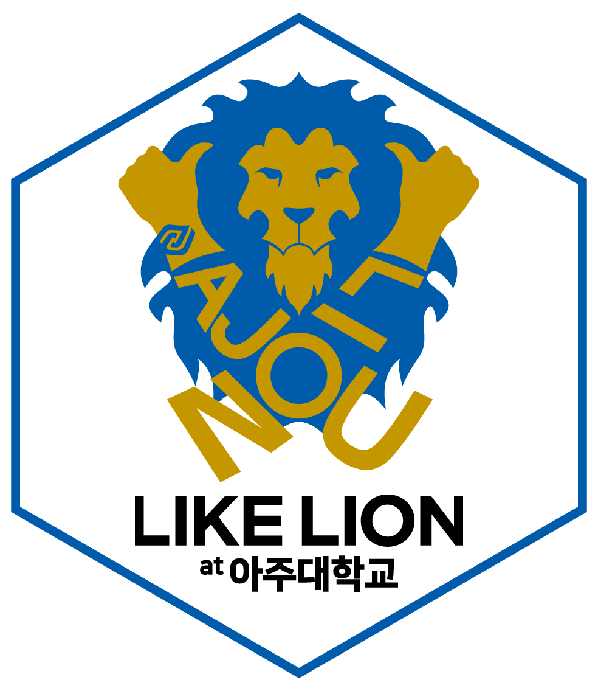
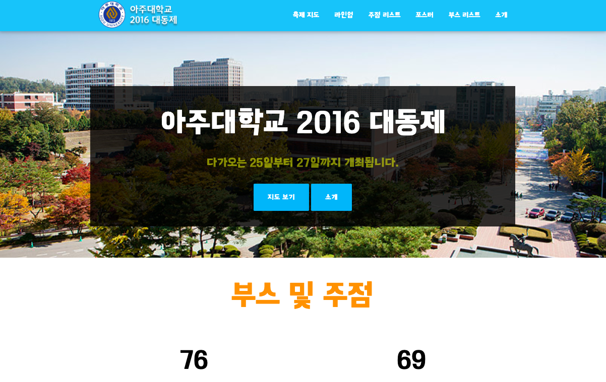

     
    

---

# 아주대학교 대동제 축제 소개 웹페이지 (2016)

**대동제 축제기간 동안 교내 축제 라인업과 부스 정보를 소개**하는 웹서비스입니다.
비전공자들의 아이디어와 웹프로그래밍이 함께 어우러져 완성된 작품으로,
축제 기간동안 **교내에서 1만건 이상의 방문자 수를 기록**하였습니다.

# Ajou University Festival Information Page (2016)
This web service provides **information on campus festival lineups and booths during the festival.**
This work was combined with the idea of non-engineers and their programming skills.
During the festival, more than 10,000 visitors visited the site.

---
Developed by 4th [likeLion](http://likelion.net)
 Members.

[멋쟁이사자처럼 at 아주대학교](http://ajou.likelion.org)